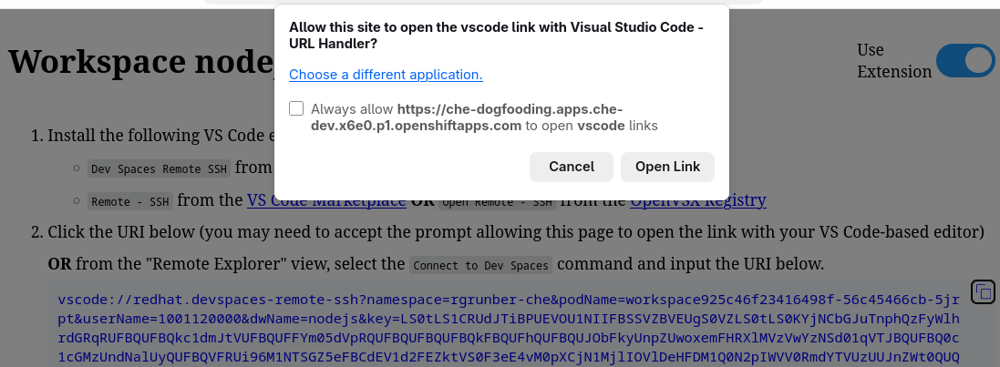
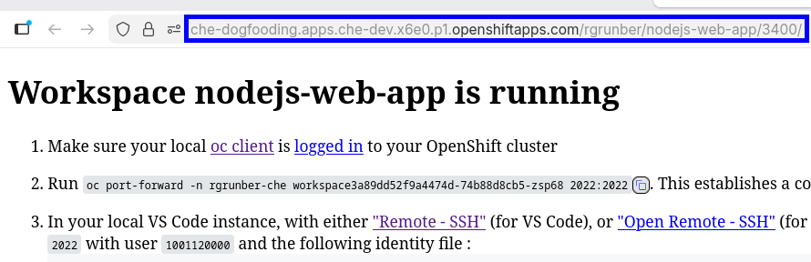
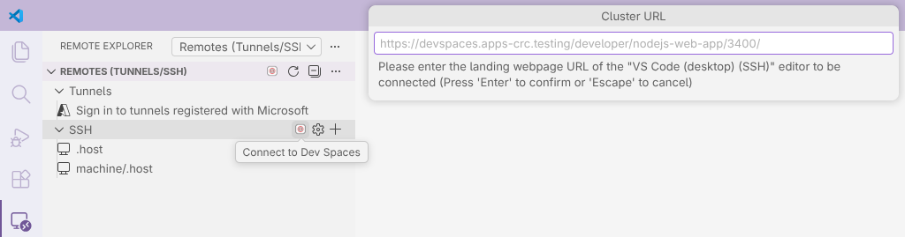
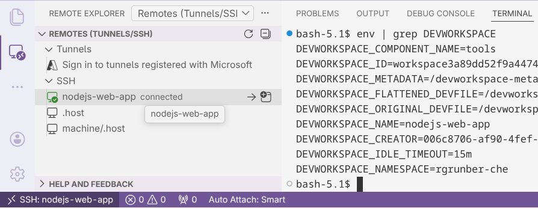

# Dev Spaces Remote SSH Extension

Support for connecting a local VS Code instance, over SSH, to a Red Hat OpenShift Dev Spaces developer workspace (DevWorkspace).

This contributes remote host entries under the "SSH" category of the "Remote Explorer" view.

## Prerequisites

- One of :
  - `Remote - SSH` (`ms-vscode-remote.remote-ssh`) provided by Microsoft for VS Code
  - `Open Remote - SSH` (`jeanp413.open-remote-ssh`) for a Code based editor

>[!NOTE]
> Cursor provides its own `Remote - SSH` (`anysphere.remote-ssh`) extension. "Dev Spaces Remote SSH" is able to handle connections through it, so if using Cursor, no additional extensions (mentioned above) are needed with this one.

>[!NOTE]
> [`oc`](https://mirror.openshift.com/pub/openshift-v4/clients/ocp/latest/), is packaged into this extension, on most supported platforms (eg. `win32-x64`, `win32-arm64`, `darwin-x64`, `darwin-arm64`, `linux-x64`, `linux-arm64`). If running on an unsupported platform, the "universal" version of the extension will be installed, which will require users to manually install/setup `oc`.

## Usage

This extension uses the existing Remote support provided by either `Remote - SSH` or `Open Remote - SSH` to contribute Red Hat OpenShift Dev Spaces developer workspaces as SSH hosts, and **automates establishing the connection**.

When `Visual Studio Code (desktop) (SSH)` is selected as an editor, it establishes an SSHD service in the user's development container (as defined by their devfile). This editor also opens a landing web page that contains instructions on how to connect to the workspace from a local VS Code-based editor. **These landing page instructions are not trivial, so this workflow simplifies the process by setting up the connection automatically.**

The extension provides two main workflows for connecting to a remote developer workspace :

### 1. Using a developer workspace URI (`vscode://`)

With Dev Spaces 3.28, the extension is able to connect to any developer workspace using the URI listed in the landing page. Refreshing the landing page, clicking the URI in a web browser, or entering the URI in the "Connect to Dev Spaces" input prompt, will cause VS Code-based editor to launch/initiate the connection.

### 2. **(Deprecated)** Using a developer workspace URL

With this workflow, simply providing the URL of the landing web page of the developer workspace. The URL will often be of the form : `https://${CLUSTER_URL}/${USER}/${DEVWORKSPACE_NAME}/3400/`

From the "Remote Explorer" view, select one of the "Connect to Dev Spaces" icons within the view and provide the landing page URL of the developer workspace (DevWorkspace).

This will redirect to the corresponding cluster's login web page. Once appropriate credentials have been entered, the existing VS Code instance will be connected to the remote developer workspace.

### 3. From the Remote Explorer view

If already logged into the cluster locally, a connection can be established in the current window, or a new one. Simply go into the "Remote Explorer" view and select a developer workspace under the "SSH" category.

## Compatibility

Generally, a newly released version of the extension will still be compatible with older Dev Spaces (eg. 3.24+). It is always recommended to be running a version of this extension that was released after the Dev Spaces version it is targetting.

| Dev Spaces Version | 3.25 | 3.26 | 3.27 |
| -------- | -------- | -------- | -------- |
| **Extension version** | 0.3.1+ | 0.3.1+ | 0.3.1+ |

## Settings

- `devspaces.ssh.log` - Log to the Output view information regarding command execution for possible debugging.
- `devspaces.ssh.update.interval` - The interval, in milliseconds (ms), at which SSH targets are synchronized to the Remote Explorer view, when logged into a cluster.
- `devspaces.ssh.window.strategy` - How connecting to a developer workspace should be done.

## Developing the extension

- Run `npm install` in terminal to install dependencies
- Run the `Run Extension` target in the Debug View. This will:
	- Start a task `npm: watch` to compile the code
	- Run the extension in a new VS Code window
